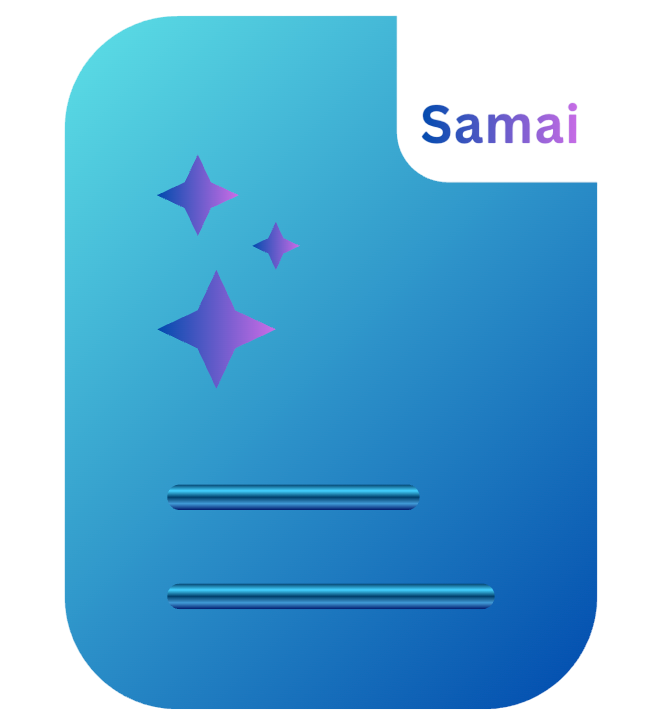

<div align="center">
  <a href="https://github.com/dt313/sumai">
    
  </a>

<h3 align="center">Sumai</h3>

  <p align="center">
    <strong>Sumai</strong> is a powerful browser extension that lets you summarize, explain, and translate content directly in your browser using modern LLM AI. Enhance your reading experience with instant AI insights tailored to your language.
    <br />
    <br />
    <a href="https://github.com/dt313/sumai">View Repo</a>
  </p>
</div>

---

## 🚀 Features

✅ **Instant Summarization** – Get concise summaries of any web page or selected text.  
✅ **Smart Translation** – Translate content into your target language with natural flow.  
✅ **Concept Explanation** – Simplify complex terms and ideas for better understanding.  
✅ **Multi-LLM Support** – Choose between ChatGPT, Claude, Gemini, and local Ollama models.  
✅ **Real-time Streaming** – See responses as they are generated for a smooth experience.  
✅ **Smart Triggers** – Activate via double-click, Shift+selection, or context menu.  
✅ **Customizable** – Adjust summary length, language, and theme (Dark/Light).  
✅ **Privacy Focused** – Your API keys are stored securely in your local extension storage.

---

## 🧑‍💻 Tech Stack

### 🖥️ Frontend & Extension

- [Plasmo](https://docs.plasmo.com/) (Browser Extension Framework)
- [React 18](https://react.dev/)
- [TypeScript](https://www.typescriptlang.org/)
- [Tailwind CSS](https://tailwindcss.com/)
- Lucide React & Heroicons
- Marked & Highlight.js (Markdown processing)

### 🔧 AI Integration

- OpenAI API (ChatGPT)
- Anthropic API (Claude)
- Google Generative AI (Gemini)
- Ollama (Local AI support)

---

## 📦 Getting Started

### ⚙️ 1. Clone the repository

```bash
git clone https://github.com/dt313/sumai.git
cd sumai
```

### ⚙️ 2. Install dependencies

```bash
pnpm install
```

### ⚙️ 3. Development

Run the development server:

```bash
pnpm dev
```

Open your browser and load the extension from the `build/chrome-mv3-dev` folder (or equivalent for your browser).

### ⚙️ 4. Production Build

To create a production-ready bundle:

```bash
pnpm build
```

The build output will be in the `build` directory, ready to be loaded or zipped for submission.

---

## 🛠️ Configuration

Once installed, click the extension icon to set up your API keys:

1. Open the extension popup.
2. Navigate to **Settings**.
3. Enter your API keys for the providers you wish to use (OpenAI, Anthropic, Google, or Ollama URL).
4. Save settings and start summarizing!

---

<div align="center">
  Built with ❤️ for better web reading.
</div>
